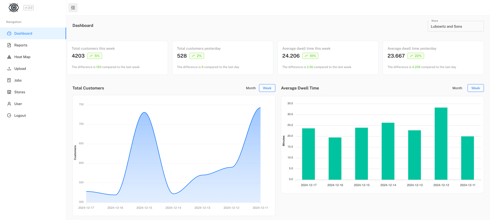
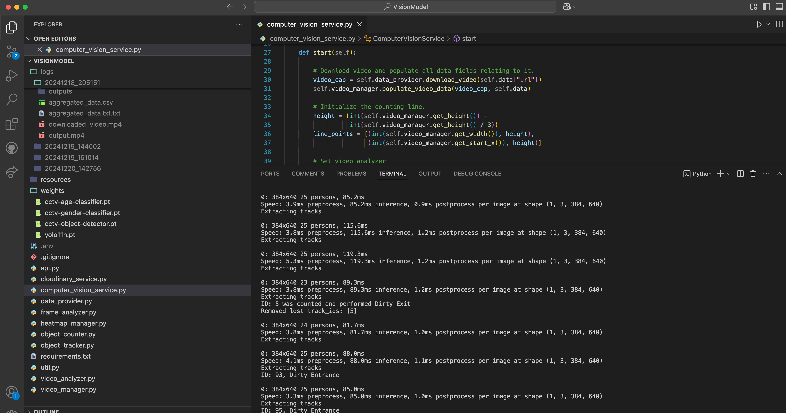

<div align="center">
  <h1>👁️ EyeSee - AI for Customer Traffic Analysis 👁️</h1>
  <p><i>Analyzing retail store customer traffic using cutting-edge machine learning.</i></p>
</div>

<div align="center" style="display: flex; justify-content: center; gap: 10px; margin-top: 20px;">
  
  
</div>

---

EyeSee is our graduation project for our B.Sc. in Computer Science at Bar-Ilan University. The project leverages advancements in computer vision and machine learning to analyze retail store customer traffic and provide actionable insights.

---

## 🚀 Our Model

We customized and trained the **Ultralytics YOLO** model to perform three major tasks:
- **👥 Person Detection and Tracking**: Identifies and follows individuals within the store.
- **📅 Age Classification**: Categorizes detected individuals into age groups.
- **⚥ Gender Classification**: Determines the gender of detected individuals.

These capabilities enable EyeSee to analyze customer traffic patterns from video footage, offering detailed insights into store activity.

---

## 🌟 Features

EyeSee provides the following main features:
- **📊 Detailed Reports**: Generates comprehensive reports based on analyzed footage.
- **📈 Dashboard**: Displays weekly and yearly trends in customer traffic.
- **🔥 Heatmaps**: Visualizes customer activity within the store for better spatial insights.

---

## 🎥 Project Presentation

Check out our [video on YouTube](https://www.youtube.com/watch?v=V07g594JBJ8)!

---

## 🗂️ Project Structure
```
$PROJECT_ROOT (EyeSee)
├── Client
│   # Client-side code
├── Server
│   # Server-side code
├── VisionModel
    # AI model files (code, weights, etc)
```

---

## 🛠️ Tech Stack
- **Frontend:** React with Material UI
- **Backend:** Node.js with Express
- **Database:** MongoDB (Atlas)
- **Machine Learning:** Python with TensorFlow/PyTorch and Ultralytics YOLO
- **Media Management:** Cloudinary

---

## 👨‍💻 Authors
- **Idan Ziv**  
  - [LinkedIn](https://www.linkedin.com/in/idanziv7/)  
  - [GitHub](https://github.com/IdanZiv97)
- **Dan Marom**  
  - [LinkedIn](https://www.linkedin.com/in/dan-marom/)  
  - [GitHub](https://github.com/danmarom16)
- **Yonatan Radai**  
  - [LinkedIn](https://www.linkedin.com/in/yonatan-radai-074616211/)  
  - [GitHub](https://github.com/YonatanRadai)

---

## Using The Project

In a file named <code>run_locally.md</code>, you can find instructions and demo data to run the project locally.
Please make sure you create your Cloudinary account and generate your own data using <code>fakeDataGenerate.js</code>.

---