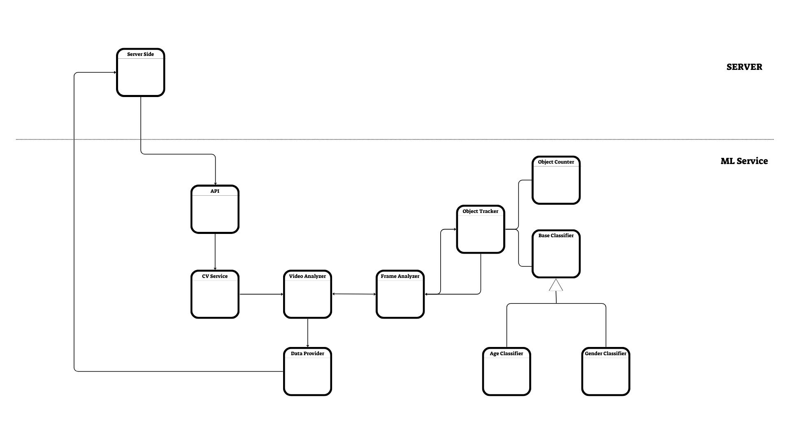

### 🔗 EyeSee VisionModel 🔗 

   <h1>🔗 EyeSee VisionModel - AI 🔗</h1>
   
<i>The intelligent engine that translates raw CCTV footage into precise demographic insights and actionable visualizations.</i>

  
  
  
  

---

The <strong> EyeSee VisionModel</strong> is the business logic component of the EyeSee project. Its purpose is to analyze CCTV footage uploaded by store owners and extract actionable data, such as:
<ul>
<li> 👤 <strong> Person Count </strong> - Tracks the number of people visible in the footage.</li>
<li> 🚻 <strong> Gender Classification </strong> - Determines the gender of individuals.</li>
<li> 🎂 <strong> Age Classification </strong> - Estimates age groups for each detected person.</li>
</ul>
This data empowers businesses to understand customer demographics and optimize their operations effectively.

---

## ✨ Features

- 🔍 **YOLOv11 Models**: 
  - **Object Tracking**: Tracks individuals in low-res CCTV footage.
  - **Gender Classification**: Classifies detected individuals into gender categories.
  - **Age Classification**: Estimates age groups of individuals.
- 📹 **Optimized for CCTV**: Specifically trained with real-world CCTV data to overcome low-resolution challenges.
- 🧑‍🎨**SOLID**: Designed with an Object-Oriented Programming approach, adhering to key principles such as Single Responsibility, Dependency Inversion, and Open-Closed. It leverages design patterns like Singleton and Dependency Injection to ensure scalability, maintainability, and robust architecture.
- ☁️ **Cloud Integration**: Uses Cloudinary for seamless asset management.

---

## 🛠️ Class Diagram

---

## 📌 Class Descriptions

1. **`api.py`**: Receives API requests for analysis and triggers the `ComputerVisionService`.
2. **`ComputerVisionService`**: 
   - Initializes and manages single instances of all objects (Singleton pattern).
   - Passes references to dependent classes.
3. **`VideoManager`**: 
   - Handles video metadata.
   - Ensures code extensibility while maintaining backward compatibility.
4. **`DataProvider`**: 
   - Manages data persistence and metrics saving.
   - Sends API requests upon analysis completion.
5. **`VideoAnalyzer`**: 
   - Orchestrates the analysis process by managing global frame counts and calling frame analysis, triggering save before analysis termination.
6. **`FrameAnalyzer`**: 
   - Guides frame analysis, object tracking, and heatmap management.
   - Handles line crossings and entry validations.
7. **`ObjectTracker`**: 
   - Manages objects in the video, including:
     - `counted_ids`: Individuals counted as clients.
     - `dirty_ids`: Individuals entering outside defined regions.
     - `past_customers`: Exited clients.
     - `tracks`: All detected objects.
   - Tracks dwell time and classifications for each object.
8. **`ObjectCounter`**: Handles counting logic independently of the tracking logic.
9. **`BaseClassifier`**: 
   - Abstract class extended by:
     - **`AgeClassifier`**: Handles age classification.
     - **`GenderClassifier`**: Handles gender classification.
   - Decouples classification technology from other components.
10. **`HeatmapManager`**: Manages heatmap creation and visualization.
11. **`CloudinaryService`**: Downloads and uploads assets to Cloudinary, dynamically injected into `DataProvider`.

---

## 👨‍💻 Authors
- **Idan Ziv**  
  - [LinkedIn](https://www.linkedin.com/in/idanziv7/)  
  - [GitHub](https://github.com/IdanZiv97)
- **Dan Marom**  
  - [LinkedIn](https://www.linkedin.com/in/dan-marom/)  
  - [GitHub](https://github.com/danmarom16)
- **Yonatan Radai**  
  - [LinkedIn](https://www.linkedin.com/in/yonatan-radai-074616211/)  
  - [GitHub](https://github.com/YonatanRadai)

---